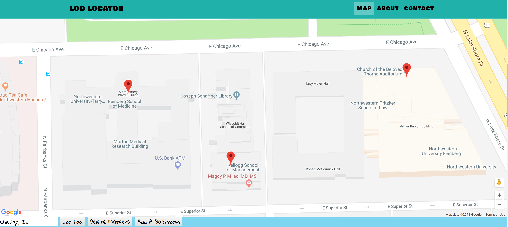

# Loo-Locator

To help people who have Crohn's, Colitis, IBS or anyone who just want to find a nice clean public restroom near you or wherever you’re headed.

# Wireframe

# Screenshots

## How to Use

<ul>

<li>When the app loads, you will automatically be brought to your current location and crowd-sourced bathrooms within your vicinity will appear on the map as red markers</li>

<li>Use search bar to search any location on the map to find  bathrooms nearby</li>

<li>If you find a public restroom not already in the app, use the 'add bathroom' button, complete the form and the bathroom will now appear on the map for others to use</li>

<li>Click on map to add a temporary tag to the map</li>

<li>Delete button removes all temporary tags to the page</li>
</ul>

## How to Contribute

We're currently looking for help developing the following feature to improve the Loo-Locator App and the user experience: 

<ul>
<li> Setup 2-mile diameter for restrooms to show on map</li>
<li>Add a family changing station filed to our input field, database and an icon to the info marker</li>
<li>Add music to allow shy bladders to relax to either their playlist or the sound of running water</li>
<li>Allow for more than a single review of a bathroom with a weighted score in both privacy and cleanliness</li>
<li>Add User Authentication to allow for future additional features</li>
</ul>

To Contribute, please reach us on our GitHub accounts below

## License

Technologies used are licensed by Google 

Template used is under [MIT License](https://github.com/BlackrockDigital/startbootstrap-grayscale
 

All other licenses are maintained by its creators

## Authors

[Jordan Gary](https://github.com/JigSays)

[Jeffrey Berman](https://github.com/twistyjeffrey)

[Blake Downes](https://github.com/Bdownes214)

# Contributors

[Google Maps API](https://maps.googleapis.com/maps/api/js?)
[Font Awesome](https://use.fontawesome.com/releases/v5.0.8/js/all.js)
[Google Fonts](https://fonts.googleapis.com/css)
[BootStrap](https://use.fontawesome.com/releases/v5.0.8/js/all.js)
[Heroku](https://loo-locator.herokuapp.com/)
[GitHub](https://github.com/JigSays/Loo-Locator)
[Start Bootstrap](https://startbootstrap.com/template-overviews/grayscale/)